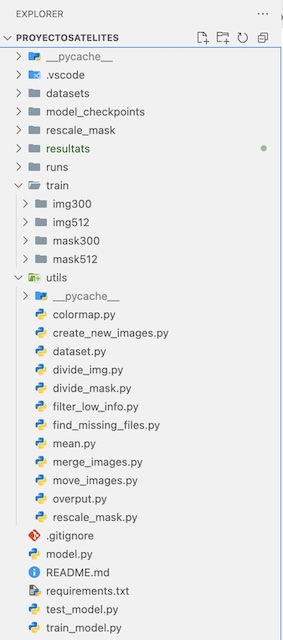

# 
# Landcover classification of Catalonia with Satellite images

Final Project for the UPC [Artificial Intelligence with Deep Learning Postgraduate Course](https://www.talent.upc.edu/ing/estudis/formacio/curs/310402/postgraduate-course-artificial-intelligence-deep-learning/) 2024-2025 edition, authored by:

* [Berta Carner](https://www.linkedin.com/in/berta-carner/)
* [Anita Quevedo](https://www.linkedin.com/in/aquevedos91/)
* [Carlos Morales](https://www.linkedin.com/in/carlos-morales-galvez/)
* [Esteve Graells](https://www.linkedin.com/in/egraells/)

Advised by professor [Mariona](https://www.linkedin.com/in/marionacaros/).

## Table of Contents (WIP)<a name="toc"></a>

- [Introduction](#introduction)
    - [Project Overview](#project-overview)
    - [Motivation](#motivation)
    - [What is Sentinel-2 project including Satellites?](#what-is-sentinel-2-project-including-satellites)
    - [Sentinel-2 Image Characteristics](#sentinel-2-image-characteristics)
    - [Project Goal](#project-goal)
- [Dataset Preparation](#dataset-preparation)
    - [Challenges of Size Misalignment](#challenges-of-size-misalignment)
    - [Data Processing](#data-processing)
    - [Downscaling the Classes Geotiff file for alignment with Sentinel-2 images](#downscaling-the-classes-geotiff-file-for-alignment-with-sentinel-2-images)
    - [Tiling the Sentinel-2 images](#tiling-the-sentinel-2-images)
        - [Possible Improvements detected](#possible-improvements-detected)
        - [Filtering uninformative tiles: Handling empty and sea-Only regions](#filtering-uninformative-tiles-handling-empty-and-sea-only-regions)
        - [Discarding tiles with snow/clouds](#discarding-tiles-with-snowclouds)
- [Model Architectures](#model-architectures)
    - [U-net Architecture](#u-net)
        - [The encoder](#the-encoder)
        - [The decoder](#the-decoder)
    - [Segformer Architecture](#segformer)
- [Training Process](#training-process)
    - [Training and Validation Splits](#training-and-validation-splits)
    - [Loss Function Calculation](#loss-function-calculation)
    - [Optimizer and Rate scheduler](#optimizer-and-rate-scheduler)
    - [Training execution loop](#training-execution-loop-iou-dice-coefficient-and-confusion-matrix)
        - [IoU (Intersect over Union)](#iou-intersect-over-union)
        - [Dice Coefficient (F-1 Score for Segmentation)](#dice-coefficinet-f-1-score-for-segmentation)
        - [Confusion Matrix](#confusion-matrix)
        - [Data Augmentation](#data-augmentation)
- [Model Checkpointing](#model-checkpointing)
- [Google Cloud Deployment](#google-cloud-deployment)
- [Evaluation & Testing](#evaluation--testing)
    - [Logging with Tensorboard](#logging-with-tensorboard)
- [Prediction & Visualization](#prediction--visualization)
- [Lessons Learned](#lessons-learned) and [Future Work](#future-work)


# Semantic Segmentation with a U-Net for Sentinel-2 Catalonia images

## Introduction 

### Project Overview
This project implements a **U-Net model** for **semantic segmentation** using Sentinel-2 satellite imagery. The model predicts land cover types for different regions, classifying each pixel into one of 12 land cover categories.

The project involves:
- Preprocessing large satellite images and corresponding ground truth masks.
- Training a U-net model based on **ResNet50** as an encoder.
- Data augmentation to improve generalization.
- Model evaluation and visualization of segmentation results.
- Using Metrics to evaluate the training with IoU, Dice 
- Logging with Tensorboard

### Motivation

Aerial photography from manned aircraft is a costly and time-intensive method for obtaining high-resolution geographic images. Additionally, the manual labeling of these images requires extensive human effort, making large-scale land cover classification an expensive and time-consuming process.

The Institut Cartogràfic i Geològic de Catalunya have been working on a more resource effective approach using AI.


With the increasing availability of satellite imagery, particularly from platforms such as Sentinel-2, it is now possible to perform land cover classification using deep learning-based image segmentation. Sentinel-2 is a multispectral Earth observation mission developed by the European Space Agency (ESA), providing high-resolution optical imagery across 13 spectral bands. These images are freely available and updated frequently, making them an excellent resource for environmental monitoring, land use classification, and disaster assessment.

 Source: Institut Cartogràfic i Geològic de Catalunya - [ICGC](https://www.icgc.cat/ca/Ambits-tematics/Observacio-de-la-Terra/COPERNICUS-i-SENTINEL-2-Geoserveis-sobre-el-territori).

By leveraging deep learning models like U-Net, we can automate the classification of land cover types, significantly reducing both the cost and time required compared to traditional methods. This approach enhances scalability and allows for real-time analysis, making it a powerful tool for applications in urban planning, agriculture, forestry, and environmental monitoring.

### What is Sentinel-2 project including Satellites?
Sentinel-2 is part of the Copernicus Earth Observation Program, managed by the European Space Agency (ESA) in collaboration with the European Commission. It consists of two satellites, Sentinel-2A and Sentinel-2B, which were launched in 2015 and 2017, respectively. These satellites work in tandem, covering the entire Earth's land surface every 5 days at the equator, enabling high-temporal-resolution imaging.


Sentinel-2 provides multispectral images with 13 spectral bands ranging from the visible to shortwave infrared (SWIR), allowing for various applications such as:

- Vegetation monitoring (agriculture, forestry, and land use changes)
- Water quality assessment (coastal and inland water bodies)
- Disaster management (floods, wildfires, landslides)
- Urban growth analysis
- Climate change studies

### Sentinel-2 Image Characteristics
The images produced by Sentinel-2 are captured at different spatial resolutions, and in this project in concret we used:
- 10-meter resolution: multi-bands, where each band represents information about a color Red, Green, Blue, and other information as Infrared known as NIR bands.


By utilizing Sentinel-2 images, this project enables cost-effective, automated land cover classification, drastically reducing the need for expensive manual labeling and high-cost aerial photography.

### Project Goal

The objective of this project is to develop an automated deep learning-based classification system capable of identifying specific land cover types from Sentinel-2 satellite imagery. 


The model is designed to perform semantic segmentation, assigning each pixel of a given image to one of 12 predefined land cover classes:

1. **Herbaceous crops** – Fields with predominantly non-woody vegetation used for agricultural production.

1. **Woody crops** – Areas cultivated with permanent tree and shrub crops, such as vineyards or olive groves.

1. **Forest** – Dense areas covered by trees and natural woodland.

1. **Scrub, meadows, and grasslands** – Open areas with sparse vegetation, including shrubs, prairies, and pastures.

1. **Bare soil** – Uncovered land with little to no vegetation, such as drylands and rocky terrains.

1. **Urban area** – Densely built-up zones, including residential, commercial, and mixed-use urban environments.

1. **Isolated urban areas** – Scattered buildings and small settlements outside of major urban centers.

1. **Green areas** – Parks, gardens, and other vegetated spaces within urban settings.

1. **Industrial, commercial, and leisure areas** – Large-scale infrastructure zones, including factories, shopping centers, and recreational facilities.

1. **Mining or landfills** – Extractive and waste disposal sites such as quarries, open-pit mines, and landfill zones.

1. **Transport network** – Roads, railways, and infrastructure supporting terrestrial transportation.

1. **Watercourses and water bodies** – Rivers, lakes, reservoirs, and artificial channels containing water.

## Dataset Preparation

This project uses Sentinel-2 satellite images from the Catalonia landcover taken in April and August.

Each of these 2 geotiff files have a resolution of 30.000 x 30.000 pixels with 10 spectral bands. These images provide detailed multispectral information crucial for distinguishing land cover types.

Regarding the dataset includes a ground truth land cover classification map, stored as a GeoTIFF file with 12 land cover classes (mentioned before). 

As the sizes do not match, a key challenge arises due to its significantly different resolution: 300.000 x 300.000 pixels for the geotiff file for the classes and 30.000 x 30.000 for the images to be classified.

### Challenges of Size Misalignment

- Spatial Resolution Mismatch: The Sentinel-2 images (30.000 x 30.000) are 10 times smaller in resolution than the classification mask (300.000 x 300.000). This discrepancy makes direct pixel-wise alignment impossible.


- Scaling Strategy: To overcome this issue, the classification mask must be downsampled using some kind of interpolation (bilinear interpolation, nearest-neighbor, cubic ...), ensuring that the categorical land cover labels remain intact without blending different classes.

- Tiling and Memory Constraints: The large size of the dataset makes it computationally intensive to process, requiring non-overlapping tiles (1000x1000 or 300x300 pixels...) to make training feasible.

- Temporal Variability: The dataset includes images from two different seasons (April and August), introducing potential differences in vegetation cover, which the model needs to generalize across.

By addressing these challenges, the dataset preparation ensures the effective training of the U-Net model while maintaining a meaningful representation of land cover types.

Summarizing, the dataset consists of:
- **Sentinel-2 images** 2 satellite images 
- **Ground truth masks** classifying each pixel into one of 12 categories.

## Data Processing

### Downscaling the Classes Geotiff file for alignment with Sentinel-2 images

When working with satellite imagery and land cover classification, downscaling a high-resolution categorical raster (e.g., a land cover classification map) to match a lower-resolution Sentinel-2 image presents specific challenges. The goal is to reduce the resolution from 300.000 × 300.000 pixels to 30.000 × 30.000 pixels while preserving the discrete class labels.

We evaluated several methods for downscaling:

1. **Nearest-Neighbor Interpolation** (Simple, fast, but may cause loss of minority classes): which produced the best results and was the method finally chosen

1. **Majority (Mode) Resampling** (Preserves dominant class while avoiding label mixing)

1. **Custom Weighted Majority Filtering** (Balances class preservation and boundary smoothing)

We used the gdal library and the rasterio and we found that those had similar results.
We finally decided to use gdal as it is also possible to use gdal from the command line, which was convenient at times.


Source: Wikipedia.

This snippet shows how we configured the transformations:

```python
options = gdal.WarpOptions(
        width=target_size[0],
        height=target_size[1],
        resampleAlg='near'  # Nearest Neighbor
)
```

### Tiling the Sentinel-2 images

When working with large satellite images and ground truth classification masks, direct processing is computationally infeasible due to the massive size of the data. A practical solution is to divide the images into smaller, non-overlapping tiles, making them manageable for deep learning models like U-Net.

Tiling is required because the following issues we faced:

- Memory Constraints: Loading full 30,000 × 30,000 images into GPU memory is not feasible in our laptops or Collab notebooks for a long time.

- Efficient Training: Smaller tiles allow batch processing, improving computational efficiency.

- Better Model Learning: Deep learning models generalize better when trained on multiple smaller patches rather than a single large image.

- Scalability: The approach allows us to process and segment different regions independently.

To find the optimal tile size, three different tiling resolutions were tested:


| Tile Size   | Number of Tiles | Pros | Cons |   |
|-----------  |:---------------:|:----:|:----:|---|
| 1000 × 1000 | 900 tiles       | Fewer tiles to store and process | Large file sizes, harder to fit into GPU memory | |
| 512 × 512	  | 3,400 tiles	| Compatible with standard CNN architectures | More storage required, longer preprocessing time |   |
| 300 × 300   | 10,000 tiles	| Best balance between tile count and GPU efficiency | Higher storage requirements
|   |

This is the folder structure that we ended up with:
```bash
/train/
├── img300/
│   ├── tile_0_0.tif
│   ├── tile_0_300.tif
│   ├── tile_300_0.tif
│   ├── ...
│
├── img512/
│   ├── tile_0_0.tif
│   ├── tile_0_300.tif
│   ├── tile_300_0.tif
│   ├── ...
├── mask300/
│   ├── ...
├── mask512/
│   ├── ...
```

After testing, 300 × 300 pixel tiles were chosen because:

- **Balance between number of tiles and storage**: Keeps dataset manageable while allowing enough samples for training.

- **Optimized GPU utilization:** Smaller patches ensure that more samples fit into batch processing.

- **Better generalization for the U-Net model**: perform well on smaller patches rather than larger context windows.

#### Possible Improvements detected

- **Overlap in Tiling**: Future implementations could introduce overlapping tiles (e.g., 50-pixel stride) to improve spatial continuity.

- **Dynamic Tile Selection**: Avoid generating tiles in empty regions (e.g., ocean areas) to save storage and computation.

- **Multi-Scale Training**: Instead of a single fixed tile size, training on multiple scales (e.g., 300 × 300 and 512 × 512) could improve robustness.

#### Filtering uninformative tiles: Handling empty and sea-Only regions

The ground truth classification mask included areas marked as 0 (no data), meaning that these areas had no valid land cover information.

Since deep learning models learn based on frequency distribution, including too many water-only tiles would lead to class imbalance, where the model would favor predicting "water" instead of distinguishing between different land cover classes.

If such tiles were included in training, they would confuse the model and potentially skew the loss function by introducing meaningless regions.

So we decided to discard certain tiles to prevent bias and inefficiencies in the dataset. Specifically, we excluded:

- **Tiles where the entire mask was 0**: Representing no data (outside the mapped land area).

- **Tiles containing only water-related classes**: To avoid over-representing the sea, which does not contribute useful segmentation information.

### Discarding tiles with snow/clouds 

While preparing the dataset for training, we aslo evaluated the impact of cloud and snow-covered areas on model performance. 


Initially, we considered discarding these regions, similar to how we removed empty and water-only tiles. However, after conducting experiments and analysis, we ultimately decided to retain them for the following reasons.

Cloud and snow-covered areas introduce unique challenges for semantic segmentation models:

- **Occlusion of Land Features**: Clouds and snow can obscure relevant land cover, making segmentation harder.

- **Potential Label Noise**: The ground truth mask might not correctly classify pixels under dense cloud cover.

- **Limited Spectral Information**: Clouds reflect light differently than land, potentially confusing the model.

Given these challenges, we tested filtering out tiles dominated by clouds or snow, similar to how we removed water-only and no-data regions.

Based on our findings, we decided to keep cloud and snow-covered tiles in the dataset as we concluded that removing clouds and snow could lead to systematic biases, making the model unreliable for seasonal variations and preserving Data Diversity will improve overall performance.

Those steps for data processing can be found in these files:
- **Image Tiling:** The Sentinel-2 images are broken into **300x300 px** patches (`divide_img.py`).
- **Rescaling Ground Truth:** The large mask file is downsampled from **300,000 x 300,000** pixels to **30,000 x 30,000** using nearest-neighbor interpolation (`rescale_mask.py`).
- **Splitting Dataset:** Images and masks are split into training and validation sets (`move_images.py`).

## Models Architecture

###  U-net Architecture

The U-Net model is a fully convolutional neural network (CNN) architecture specifically designed for semantic segmentation. It was originally developed for medical image segmentation, but its encoder-decoder structure makes it highly effective for geospatial tasks, such as land cover classification using Sentinel-2 images.

 Source: University of Freiburg [https://uni-freiburg.de](https://lmb.informatik.uni-freiburg.de/people/ronneber/u-net/).

U-Net is widely used in satellite image analysis due to several key advantages: 

-  Preserves Spatial Information → Unlike traditional CNNs, U-Net maintains high-resolution spatial details, which is critical for segmenting land cover types.

-  Captures Global & Local Features → The encoder extracts global patterns, while the decoder restores fine details for precise segmentation.

-  Works Well with Small Datasets → U-Net performs well even with limited training data, making it ideal for geospatial applications where labeled data is scarce.

-  Efficient for High-Resolution Images → The model processes large images effectively while keeping computational costs manageable.

The U-Net model follows a U-shaped architecture, consisting of two main components:

1. Encoder (Contracting Path) – Feature Extraction

1. Decoder (Expanding Path) – Reconstruction & Segmentation

1. Skip connections

####  The encoder

The **encoder** acts as a feature extractor, similar to a standard convolutional network like ResNet or VGG.

- Uses convolutional layers with ReLU activation to extract feature maps.
Applies max pooling layers to progressively reduce spatial dimensions while increasing depth. The deeper layers capture high-level land cover patterns (e.g., distinguishing forests from urban areas).
We decided 

Additionally, it includes skip connections, which help retain important details lost during downsampling.

We created 2 different encoders:
1 - From scratch with all the layers
2- Resnet50

As in the following snippet we decided to go for using ResNet50 as a pretrained feature extractor provides several advantages:

- Already learned rich feature representations from millions of images.

- Sentinel-2 images share similar textures, edges, and patterns with natural images (e.g., forests, urban areas), so the pretrained ResNet50 can generalize well.

- Less data required for training which helps when labeled satellite images are limited.

```python
def __init__(self, num_classes, image_size= 300):
    super(UNet, self).__init__()
    self.encoder = models.resnet50(weights=models.ResNet50_Weights.IMAGENET1K_V1)
    self.base_layers = list(self.encoder.children())[:-2]  # Quita la capa FC y el avgpool
    self.encoder = nn.Sequential(*self.base_layers)
    ...
```

#### The decoder

The **decoder** gradually restores the image resolution and assigns class labels to each pixel.
- Uses transposed convolution (deconvolution) layers to upscale feature maps.
Applies batch normalization and ReLU activation to refine details.
Uses skip connections from the encoder to recover lost spatial details.

One of U-Net’s most powerful features is the use of skip connections  which directly copies feature maps from the encoder to the corresponding layer in the decoder. This allows to:

- Combines low-level details (texture, edges) with high-level abstract features (object types).
- Prevents information loss due to downsampling.

This is the code snippet for our decoder in the U-net:

```python
# Decoder adaptado a ResNet50 (2048 canales en la última capa)
self.decoder = nn.Sequential(
    nn.ConvTranspose2d(2048, 1024, kernel_size=2, stride=2),
    nn.BatchNorm2d(1024),
    nn.ReLU(inplace=True),
    nn.ConvTranspose2d(1024, 512, kernel_size=2, stride=2),
    nn.BatchNorm2d(512),
    nn.ReLU(inplace=True),
    nn.ConvTranspose2d(512, 256, kernel_size=2, stride=2),
    nn.BatchNorm2d(256),
    nn.ReLU(inplace=True),
    nn.ConvTranspose2d(256, 128, kernel_size=2, stride=2),
    nn.BatchNorm2d(128),
    nn.ReLU(inplace=True),
    nn.ConvTranspose2d(128, 64, kernel_size=2, stride=2),
    nn.BatchNorm2d(64),
    nn.ReLU(inplace=True),
    nn.ConvTranspose2d(64, 32, kernel_size=2, stride=2),
    nn.BatchNorm2d(32),
    nn.ReLU(inplace=True),
)

# Capa de salida con las clases
self.conv_out = nn.Conv2d(32, num_classes, kernel_size=1)
self.upsample = nn.Upsample(size=(image_size, image_size), mode='bilinear', align_corners=True) 
```

Summarizing, our project implements the U-Net architecture (`model.py`) formed by these parts:
- **Encoder:** ResNet50 pre-trained on ImageNet.
- **Decoder:** Transposed convolutions upsample feature maps.
- **Final Output Layer:** A **1x1 convolution** maps features to `num_classes`.
- **Upsampling:** Ensures the output matches the original image size.

### Segformer archictecture

TODO Berta

## Training Process

The training process follows a structured pipeline, covering data preparation, model training, loss calculation, evaluation, and optimization. Below is a detailed breakdown of each stage.

As mentioned before we used several tile sizes 1000x1000, 512x512 and 300x300 but finally decided to move forward with the latter and data augmentation to increase the number of files.

### Training and Validation Splits
The dataset used for training consists of Sentinel-2 images and their corresponding land cover masks. The dataset is split into training (80%) and validation (20%).

```python
# Dataset y DataLoader
train_images_dir = "train/img300"
train_masks_dir = "train/mask300"
train_dataset = SegmentationDataset(train_images_dir, train_masks_dir, transform=get_transforms())

train_size = int(porcentaje_train * len(train_dataset)) 
val_size = len(train_dataset) - train_size 
print(f"Train size images: {train_size}, Validation size images: {val_size}")

train_dataset, val_dataset = random_split(train_dataset, [train_size, val_size])
# train_loader = DataLoader(train_dataset, batch_size=batch_size, shuffle=True)
train_loader = DataLoader(train_dataset, batch_size=batch_size, shuffle=True, num_workers=workers, pin_memory=pin_memory)
val_loader = DataLoader(val_dataset, batch_size=batch_size, shuffle=False, num_workers=workers, pin_memory=pin_memory) 
...
```

We trained the model in different scenarios:

| Hardware   | Duration | Epochs |
|-----------  |:---------------:| :---: |
| CPU | 12 hours | 100
| GPU RTX 3050 8GB | 6 hours | 100 
| iGPU Apple Silicon M4 | 9 hours | 100 
| Google Cloud |  TODO Anita  | 100

As expected the best results were obtained when using Cloud computing resources, and it was really slow on none dedicated GPUs.

### Results

Following are the results obtain with the hyperparameters listed as follows:

| Parameter    | Value  |
|-------------|--------|
| num_classes | 12     |
| batch_size  | 12     |
| epochs      | 100    |
| lr          | 0.001  |
| workers     | 5      |
| pin_memory  | True   |


```bash
Clase 1: 92.29% accuracy
Clase 1: IoU: 0.8318, Dice: 0.9082
Clase 2: 88.72% accuracy
Clase 2: IoU: 0.7625, Dice: 0.8653
Clase 3: 91.89% accuracy
Clase 3: IoU: 0.6229, Dice: 0.7676
Clase 4: 76.95% accuracy
Clase 4: IoU: 0.5061, Dice: 0.6720
Clase 5: 53.50% accuracy
Clase 5: IoU: 0.2824, Dice: 0.4404
Clase 6: 90.48% accuracy
Clase 6: IoU: 0.7024, Dice: 0.8252
Clase 7: 59.25% accuracy
Clase 7: IoU: 0.0863, Dice: 0.1589
Clase 8: 53.81% accuracy
Clase 8: IoU: 0.3716, Dice: 0.5419
Clase 9: 76.09% accuracy
Clase 9: IoU: 0.5317, Dice: 0.6943
Clase 10: 86.60% accuracy
Clase 10: IoU: 0.8742, Dice: 0.9329
Clase 11: 51.77% accuracy
Clase 11: IoU: 0.3771, Dice: 0.5476
Mejor modelo guardado con Loss: 0.3668
```

The following confusion matrix reveals the model's ability to correctly classify different classes, highlighting that some classes are recognized with higher accuracy than others. Despite this variation, the overall performance remains satisfactory.


###  Loss Function Calculation 

We use the `CrossEntropyLoss` function for loss calculation for multi-class semantic segmentation, where each pixel belongs to one of 12 land cover classes, CrossEntropyLoss is the most appropriate choice because:

-  Handles Multi-Class Classification Efficiently → Unlike binary classification loss functions (e.g., BCEWithLogitsLoss), CrossEntropyLoss can compute probabilities for multiple classes per pixel.

-  Softmax Activation Compatibility → The model outputs logits (unnormalized scores), which CrossEntropyLoss converts into class probabilities using an implicit softmax function.

-  Encourages Confident Predictions → Assigns higher penalties for incorrect classifications, forcing the model to make more confident, correct predictions.

-  Class Balancing via Weights → In this implementation, we assign zero weight to class 0 (out-of-bounds areas), ensuring that background regions don’t distort training.

The following special circumstances have been considered:

-  Class 0 (No Data) is ignored to prevent distorting loss calculations.
-  Balances class distribution to prevent underrepresented classes from being ignored.

```python
criterion = nn.CrossEntropyLoss(weight=class_weights, ignore_index=0)
```

### Optimizer and Rate scheduler

We use the Adam optimitzer as it is an advanced gradient-based optimization algorithm that combines the benefits of SGD with momentum and RMSprop. It is a very common choice for training U-Net for multi-class land cover segmentation because:

-  Adaptive Learning Rates → Adam automatically adjusts the learning rate for each parameter, allowing the model to converge faster and handle different feature scales.

-  Momentum-Based Updates → Uses momentum (first and second moment estimates) to accelerate training and avoid oscillations.

-  Less Sensitive to Hyperparameters → Unlike standard SGD, Adam requires minimal manual tuning and performs well with default settings.

-  Handles Sparse Gradients Efficiently → Useful in land cover segmentation, where some classes (e.g., urban areas) appear less frequently in images.

Our learning rate scheduler used allow us to adapt the learning rate dynamically, improving convergence and preventing unnecessary updates. `ReduceLROnPlateau` is a convenient choice because:

-  Reduces Learning Rate When Training does not progress: If validation loss stops improving, the learning rate is halved (factor=0.5) to encourage better optimization.

-  Prevents Overfitting as Large learning rates can lead to instability, while reducing it allows for finer weight adjustments.

-  Avoids Premature Convergence and ensures that the model continues improving beyond initial training stages.

This is the code snippet on our code using the described optimizer and learning rate:

```python
optimizer = torch.optim.Adam(model.parameters(), lr=0.001)
scheduler = ReduceLROnPlateau(optimizer, mode='min', factor=0.5, patience=3)
```

### Training execution loop: IoU, Dice Coefficient and Confusion Matrix
The training loop runs for 100 epochs, tracking loss, accuracy, IoU, and Dice coefficient.

```python
for epoch in range(epochs):
    epoch_start_time = datetime.now().strftime("%Y-%m-%d %H:%M:%S")
    model.train()
    running_loss = 0.0
    class_correct = torch.zeros(num_classes).to(device)
    class_total = torch.zeros(num_classes).to(device)
```

#### IoU (Intersect over Union) 
We used IoU to measure the segmentation accuracy per class. IoU measures how much of a predicted segmentation overlaps with the ground truth.

It reduces the impact of class imbalance by considering false positives and false negatives.
Great for analyzing segmentation quality on an individual class level.

This is the function used in our code to calculate the IoU:
```python
def calculate_iou(pred, target, num_classes):
    iou_list = []
    for cls in range(1, num_classes):  # Ignoring class 0
        pred_inds = pred == cls
        target_inds = target == cls
        intersection = (pred_inds & target_inds).sum().item()
        union = (pred_inds | target_inds).sum().item()
        if union == 0:
            iou_list.append(float('nan'))  # If no ground truth, do not include in IoU calculation
        else:
            iou_list.append(intersection / union)
    return iou_list
```

#### Dice Coefficinet (F-1 Score for Segmentation) 
We used to grab a better sense of how well small regions are segmented, as it balances precision and recall. This is useful as our dataset is imbalanced: e.g.,  urban areas are much lower compared to vegetation and forest.

This is the function used in our code to calculate the Dice Coefficient:

```python
def calculate_dice(pred, target, num_classes):
    dice_list = []
    for cls in range(1, num_classes):  # Ignoring class 0
        pred_inds = pred == cls
        target_inds = target == cls
        intersection = (pred_inds & target_inds).sum().item()
        denominator = pred_inds.sum().item() + target_inds.sum().item()
        if denominator == 0: # To avoid division by zero
            dice = 0
        else:
            dice = (2 * intersection) / denominator
        dice_list.append(dice)
    return dice_list
```

#### Confusion Matrix

The confussion matrix provides class-wise error analysis by showing which classes are often not well classified.
We used the normalization method to compare fairly, as the class distributions vary quite much in our dataset.

```python
cm = confusion_matrix(all_labels, all_preds, labels=list(range(num_classes)))
cm_normalized = cm.astype('float') / cm.sum(axis=1)[:, np.newaxis]
```

### Logging with Tensorboard
As TensorBoard is a powerful tool that provides visualizations of training metrics, helping to track performance, diagnose issues, and optimize model training, we decided to use it in this project.

We used to log loss values, learning rates, and model performance over time.

Several snippets are required:

```python
writer = SummaryWriter()
...
writer.add_scalar('Loss/train', epoch_loss, epoch)
writer.add_scalar('Learning Rate', optimizer.param_groups[0]['lr'], epoch)
...
writer.close()
```

Finally to obtain the results on Tensorboard we used the following line while training:
```bash
tensorboard --logdir=runs/
```

We could add IoU and Dice but the representation of those value were good enough in the console, so we did not add them at the end.

### Model Checkpointing 
We used for saving the best-performing model, ensuring that progress is not lost due to interruptions or poor performance in later epochs.

```python
if epoch_loss < best_loss:
    best_loss = epoch_loss
    name = f"model_{epoch}_{epoch_loss:.4f}.pth"
    torch.save(model.state_dict(), name)
    print(f"Mejor modelo guardado con Loss: {epoch_loss:.4f}")
```

### Deploying on Google Cloud


## Evaluation & Testing

A separate script (`test_model.py`) loads a trained model and evaluates its performance on test images.
- **Prediction Visualization:** Predictions are compared against ground truth using a **colormap-based overlay** (`colormap.py`).
- **Metrics:** Standard segmentation metrics like **IoU (Intersection over Union)** and **pixel accuracy** can be calculated.


## Data Augmentation

As we had a limited set of tiles we considered to use Data augmentation as a crucial step to help the model learn to recognize land cover types under different conditions and avoid overfitting (preventing the model from memorizing the dataset by introducing variations that it hasn’t explicitly seen before.)

But, even in our project as we use real-world satellite images, landscapes may appear at different angles, lighting conditions, and perspectives, so augmenting the data even fits as a more realistic approach to take.

We also used data augmentation for some land cover classes appearing less frequently, so in this way we augmentated, even though artificially, their presence in the dataset.

This is the code snippet (`create_new_images.py`) in our code that describes the data augmentations that we experimented with:

```python
# Transformaciones de data augmentation
# Clases con baja representación
low_rep_classes = {5, 7, 8, 10, 11}
threshold = 0.05 

augmentations = {
    "rot90": lambda x: x.rotate(90),
    "rot180": lambda x: x.rotate(180),
    "rot270": lambda x: x.rotate(270),
    "flip_h": lambda x: x.transpose(Image.FLIP_LEFT_RIGHT),
    "flip_v": lambda x: x.transpose(Image.FLIP_TOP_BOTTOM),
}
```

## Prediction & Visualization
- The `test_model.py` script performs inference on test images.
- Predictions are converted to colored masks using the `land_cover_cmap` colormap.
- The script also generates a **legend of detected land cover types** for interpretability.

TODO: falta imagen

## Lessons learnt and future work

During the project we cleary learnt that:
- **Handling Large Datasets:** Processing large geospatial data requires memory-efficient techniques like **tiling** and **downsampling**.
- **Class Imbalance:** Some land cover classes were underrepresented, necessitating **data augmentation**.
- **Transfer Learning Benefits:** Using **ResNet50** as a feature extractor significantly improved performance.
- **Colormap Interpretability:** Assigning distinct colors to land cover types improves human interpretability of model predictions.

We compiled a list of possible future improvements:
- **Refining Metrics:** Adding different loss functions as **INS (Inverse Number of Samples)** that is a weighting strategy where the importance of each class or sample is inversely proportional to its frequency in the dataset. 
This technique seems adequate as is used for class balancing when training models on imbalanced datasets, like ours. 

- **Focal Loss Calculation:** Implementing **Focal Loss** to address class imbalance by focusing more on hard-to-classify examples. This loss function dynamically scales the loss for each example, reducing the impact of well-classified examples and emphasizing those that are misclassified.

- **Hyperparameter Optimization:** Fine-tuning learning rates and batch sizes for improved performance. The usage of tools like [Tune](https://arxiv.org/abs/1807.05118) from Richard Liaw, Eric Liang, Robert Nishihara, Philipp Moritz, Joseph E. Gonzalez, Ion Stoica.

- **Better Augmentations:** Introducing **color jitter** and **random cropping**, and overlapping tiles to improve robustness, even though overlapping tile would require an adjustment in the dataset to avoid redundancies.

#TODO: añadir otros

# Addendum

This is the final folder structure of the project:


